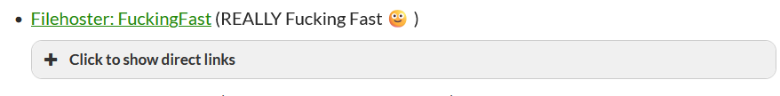
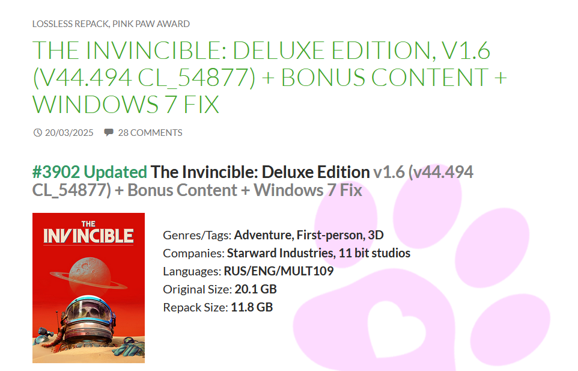
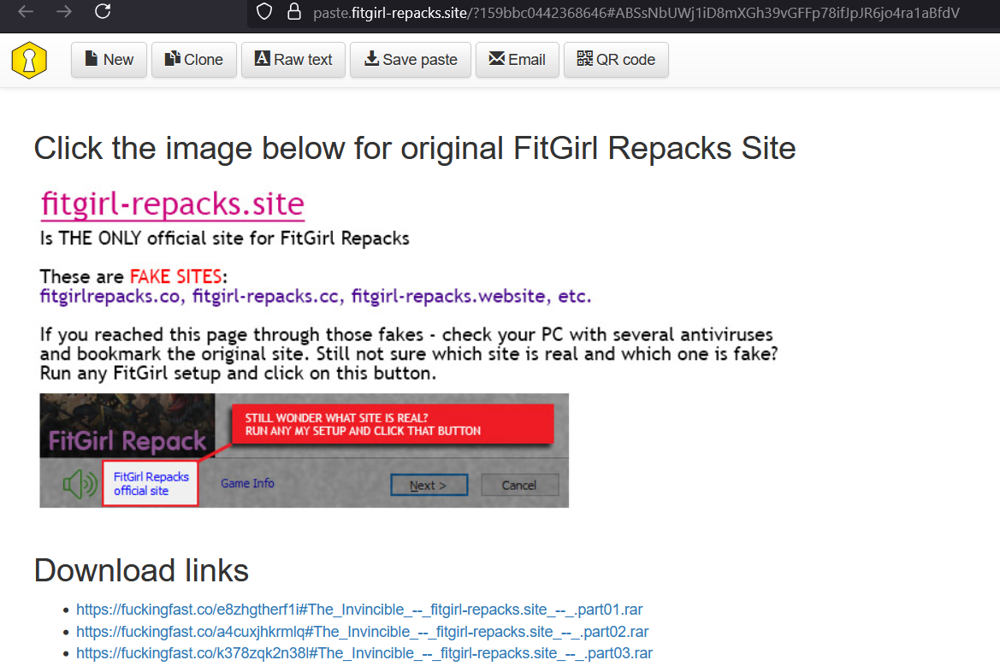
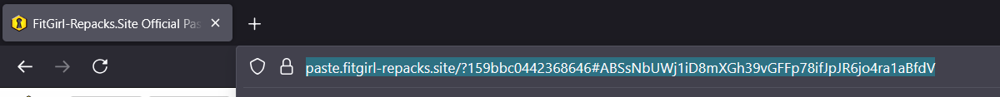

# FitGirl Repack Download Script

This is a python script that automatically download game from [fitgirl-repacks](https://fitgirl-repacks.site/). 

The script uses [Selenium](https://www.selenium.dev/) for Web-driver, [BeautifulSoup4](https://pypi.org/project/beautifulsoup4/) for web scrapping and [Requests](https://pypi.org/project/requests/) for downloading files.

## Description
Downloading games using torrent can be very slow and downloading from file hosting sites provide faster download but result in multiple download links. 

You also have to go to each of the links, which redirect you to file hosting sites and you have to get the direct download link there.
This can be tedious when you have to manually go and download from more than hundred of download link for a single game. 

This script solve the issue by automatically fetch redirect links, go to file hosting sites, get direct download link and download it for you.

You only have to provide the main URL of the main Fitgirl-repack paste bin which contain all redirect link to file hosting site and the script will fetch all links and manually download it for you.

## ! Important Notes
The goal of this project is to improve and showcase my skills in python automation and web scrapping. 

The software is free to use and use of this software is at the user's own responsibility. The developers are not liable for any consequences arising from its use.

It is recommended to use a VPN when using this script.

Currently only the fuckingfast file hosting option of fitgirl repack can be used.

## Prerequisites
Before running the script, ensure you have the following installed:

1. Python 3.8 or higher: Download and install Python from [python.org](https://www.python.org/downloads/).

2. Chrome Browser: This script uses chrome web-driver and it need chrome browser to run. Download and install Chrome Browser from [Chrome](https://www.google.com/chrome/).

## Installation

1. Clone the Repository:
```bash
git clone https://github.com/PaingPhyoAungKhant/fitgirl_repack_download_script.git
cd fitgirl_repack_download_script
```

2. Install Dependencies:
```bash
pip install -r requirements.txt
```
## Usage

1. Go to [fitgirl-repacks site](https://fitgirl-repacks.site/)

2. Select any game you want to download. 


3. Go to fuckingfast file hosting paste bin 


4. Fitgirl-repack Paste Bin


5. Copy the link of the website 


6. Run the Script: 
```python 
python3 index.py
``` 

7. Follow the Prompts:

    * Enter the wait time between downloads (default is 60 seconds).

    * Paste the URL of Paste Bin Site using Ctrl + V or Shift + Ctrl + V.
    
8. Monitor Downloads:

    * The console will display the download progress for each file.

    * If a download fails, the script will retry up to 6 times.

## Example

```bash
$ python index.py
Welcome to Repack Downloader
Please enter wait time in seconds:
This is for waiting between each download to avoid bot detection.
Default is 60. Press Enter for default waiting time: 30
Enter URL: https://paste.fitgirl-repacks.site/?3721623ce9b2967b#7okXnqH3NXqC4rn5UVip3LPdnG2NpvxK9t2S74HL9EhJ
All links fetched successfully.
Starting Download...
Downloading file1.zip: 50.00% complete
Finished downloading file1.zip.
Waiting 30 seconds until the next download...
Downloading file2.zip: 100.00% complete
Finished downloading file2.zip.
All downloads completed successfully.
```

## License

[MIT](https://choosealicense.com/licenses/mit/)